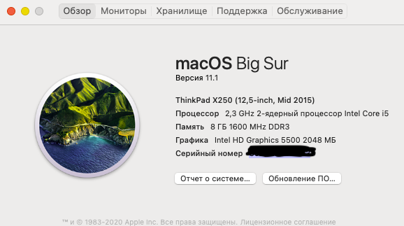

# Thinkpad X250 Catalina Big sur Opencore


## Информация

- Это полная рабочая конфигурация для ноутбука Thinkpad X250 со стоковой картой WiFi Intel 7265.
- Layout-id = 32 для звуковой карты, для устранения шума в наушниках используйте скрипт ALCPlugFix.
- Поддержка тачскрина с жестами.
- Поддержка macOS Catalina.
- Поддержка ThinkPad T450 ThinkPad T450s.

## Железо

```  
- CPU：Intel Core i5-5200U

- Intel HD 5500 Graphics 

- ALC292

- Intel Wireless 7265
```

# ThinkPad Assistant 
- Позволяет использовать функциональные клавиши T450s X250 T450.
- Скопируйте ThinkpadAssistant в папку Программы.
- Запустите ThinkpadAssistant и поставьте галочку "Start when logged in" на панели меню.
- F4: Отключение микрофона (с LED индикацией).
- F7: Конфигурация экрана(дублирование).
- F8: Вкл/выкл WiFi.
- Left Shift+F8: Вкл\Выкл Bluetooth.
- F9: Открыть системные настройки.
- F12: Открыть Launchpad.
- FN+Space: Подсветка клавиатуры.
- FN + 4: Сон.
  (При подключении внешнего монитора при нажатии Сна отключается экран ноутбука выводя изображение только на внешние мониторы, для отмены нажмите Сон опять)
- PrtSc замапен на F13: Может быть задан как кнопка для скриншота в системных настройках.
-----------------------------------------------------------------------------------------------------------------


## BIOS (1.37)
-  Security -> Security Chip`: **Disabled**;
-  Memory Protection -> Execution Prevention`: **Enabled**;
-  Virtualization -> Intel Virtualization Technology`: **Enabled**;
-  Internal Device Access -> Bottom Cover Tamper Detection`: must be **Disabled**;
-  Anti-Theft -> Current Setting`: **Disabled**;
-  Anti-Theft -> Computrace -> Current Setting`: **Disabled**;
-  Secure Boot -> Secure Boot`: **Disabled**;
-  UEFI/Legacy Boot`: **UEFI Only**;
-  CSM Support`: **Yes**.

## Работает
- CPU
- Сон
- Wifi
- Bluetooth
- Встроенная сеть
- Звук
- USB
- Батареи
- Тачскрин
- Трекпад
- Трекбол
- miniDP
- Кардридер

## Не работает
- VGA
